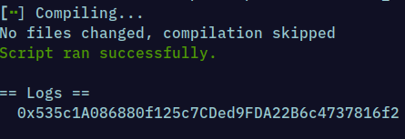
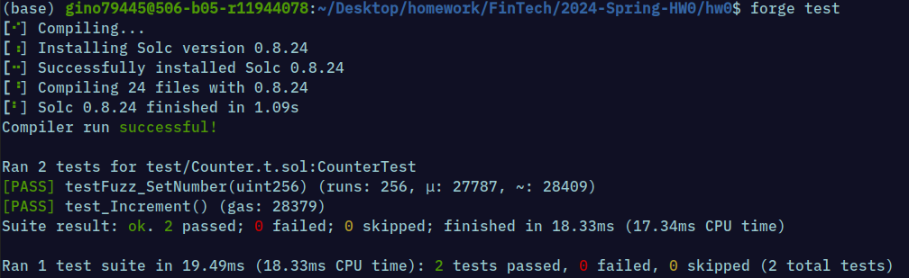
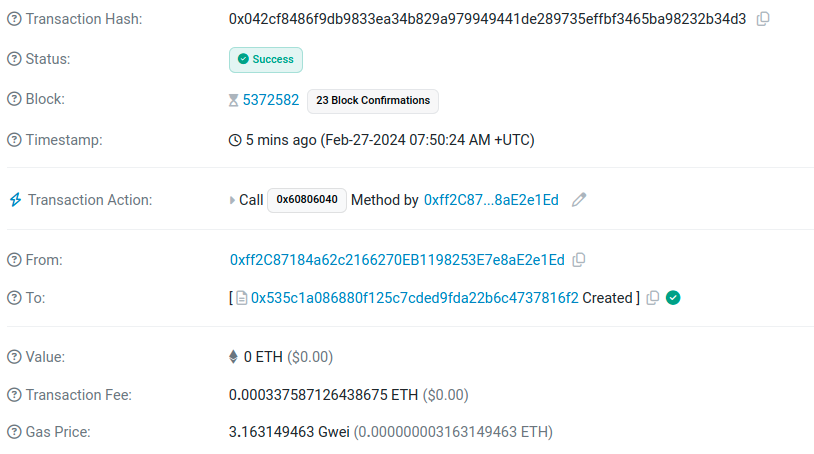

# 2024-Spring-HW0

All the detailed specified in Homework 0 documentation.

## Wallet Address
Please provide your MetaMask wallet address:
0xff2C87184a62c2166270EB1198253E7e8aE2e1Ed
## Local Testing
Please provide a screenshot of the `forge test -vvv` command running in your local environment.

Please provide a screenshot of the `forge test -vvv` command running in your local environment.

## Contract Address
Please provide the contract address that you deployed on the Sepolia network.
0x535c1A086880f125c7CDed9FDA22B6c4737816f2
## Sepolia Etherscan
Paste the contract address into the Sepolia Etherscan and share the screenshot.
 

